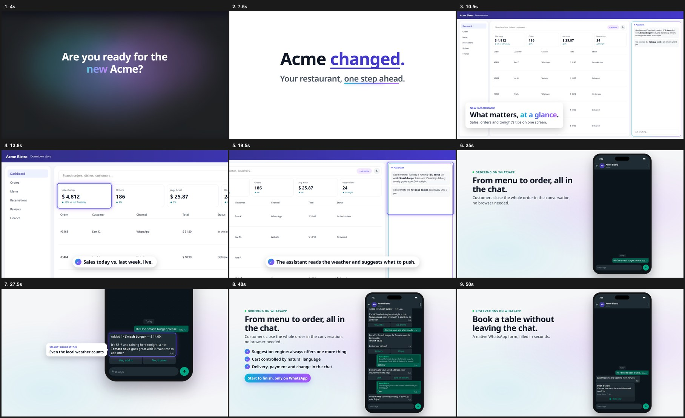

# video-app-recorder

**Product videos of your web app, built by an AI agent from real screens.**

A CLI and an agent skill (Claude Code, Codex, Cursor) that turn a request like *"a 90-second
what's-new video of our dashboard and WhatsApp ordering"* into rendered MP4s, using
[HyperFrames](https://github.com/heygen-com/hyperframes) (HTML → video).



- [What it does](#what-it-does)
- [1. Requirements](#1-requirements)
- [2. Install the CLI](#2-install-the-cli)
- [3. Install the skill in your agent](#3-install-the-skill-in-your-agent) — [Claude Code](#claude-code) · [Codex](#codex) · [Cursor](#cursor)
- [4. Configure a video project](#4-configure-a-video-project)
- [5. Use it](#5-use-it)
- [Try the demo](#try-the-demo)
- [Troubleshooting](#troubleshooting)

## What it does

- **Captures real screens** of your app running locally: login from environment variables, declarative
  steps (click, fill, type, JS), PNG + H.264 recordings and measured coordinates of every region to highlight.
- **Generates the scenes** from one `video.config.json`: a mystery `hook`, a camera `zoom` tour with rings
  and callouts, a WhatsApp-like phone `chat` (typing indicator, composer typing, button taps, quotes,
  Flow-style cards and form sheets, a camera focus on the smartest message), a `closing` with your
  website typed letter by letter, and `custom` HyperFrames compositions.
- **Two variants** from the same body: *coming soon* (announce now) and *launch* (release day).
- **Music on the beat**: extends a track you pick by cutting only on bar lines (the drop lands on the
  reveal and on the climax), or an original calm synth bed; sound effects placed automatically.
- **Renders and normalizes** every variant to −14 LUFS.

## 1. Requirements

| Dependency | Why | Windows | macOS | Linux (Debian/Ubuntu) |
|---|---|---|---|---|
| Node.js 22+ | CLI and scripts | `winget install OpenJS.NodeJS.LTS` | `brew install node` | [NodeSource](https://github.com/nodesource/distributions) or `nvm install 22` |
| FFmpeg | recordings, audio, normalization | `winget install Gyan.FFmpeg` | `brew install ffmpeg` | `sudo apt install ffmpeg` |
| HyperFrames CLI | rendering, Chrome headless, sound effects | `npm install -g hyperframes` | same | same |
| Python 3 + NumPy + SciPy | music scripts | `winget install Python.Python.3.12` then `pip install numpy scipy` | `brew install python` then `pip3 install numpy scipy` | `sudo apt install python3-numpy python3-scipy` |
| Git | clone the repo | `winget install Git.Git` | `xcode-select --install` | `sudo apt install git` |

Check everything:

```bash
node --version            # v22 or newer
ffmpeg -version
npx hyperframes doctor    # Node, FFmpeg and Chrome headless shell
python -c "import numpy, scipy; print('ok')"   # python3 on macOS/Linux
```

You also need **your app running locally** (or on a staging host) **with demo data**. Never point the
capture at production.

## 2. Install the CLI

```bash
# From GitHub
npm install -g github:felipeelopes/video-app-recorder
video-app-recorder help

# Or run without installing
npx github:felipeelopes/video-app-recorder help

# Or from a clone
git clone https://github.com/felipeelopes/video-app-recorder
cd video-app-recorder && npm link
```

## 3. Install the skill in your agent

The skill is the folder `skill/video-app-recorder` (a `SKILL.md` plus scripts). The CLI copies it to
the place each agent reads skills from:

```bash
video-app-recorder install-skill --for claude            # ~/.claude/skills/video-app-recorder
video-app-recorder install-skill --for codex             # ~/.codex/skills/video-app-recorder
video-app-recorder install-skill --for cursor            # ~/.cursor/skills/video-app-recorder
video-app-recorder install-skill --for antigravity       # ~/.gemini/config/skills/video-app-recorder
video-app-recorder install-skill --for agents            # ~/.agents/skills (read by Codex, Cursor, Antigravity)
video-app-recorder install-skill --for claude,cursor --project .   # inside the current repo instead
```

Restart the agent (or open a new session) after installing so it discovers the skill. Re-run the
command after updating the package to refresh the copy.

### Claude Code

- **Install:** `video-app-recorder install-skill --for claude` (personal) or `--project .` (shared with
  the repo in `.claude/skills/`).
- **Use:** type `/video-app-recorder` followed by the request, or just ask for a product video and Claude
  loads the skill by its description:
  ```
  /video-app-recorder a 60s what's-new video of our dashboard and WhatsApp ordering, for LinkedIn
  ```
- Claude asks before long or costly steps (render) and before anything that needs your credentials.

### Antigravity

- **Install:** `video-app-recorder install-skill --for antigravity` (global, in `~/.gemini/config/skills/`).
- **Use:** Ask the agent for a product video or run `/video-app-recorder`. The skill automatically investigates
  the codebase first (`PRODUCT.md`, `README.md`, routes, brand assets, real website URL) to avoid hallucinated
  features or fake chat flows.

### Codex

- **Install:** `video-app-recorder install-skill --for codex` (user) or `--for codex --project .`
  (repo, in `.agents/skills/`). Codex also reads `~/.agents/skills`.
- **Use:** mention the skill with `$video-app-recorder` or describe the task and let Codex pick it:
  ```
  $video-app-recorder make a teaser and a launch video of the new booking flow
  ```
- **Sandbox:** capture and render start Chrome, call `localhost` and download from npm/CDN. Approve
  the commands when Codex asks, or allow network in the workspace sandbox in `~/.codex/config.toml`:
  ```toml
  approval_policy = "on-request"
  sandbox_mode = "workspace-write"

  [sandbox_workspace_write]
  network_access = true
  ```

### Cursor

- **Install:** `video-app-recorder install-skill --for cursor` (user) or `--for cursor --project .`
  (repo, in `.cursor/skills/`). Cursor also loads skills from `~/.claude/skills` and `~/.codex/skills`,
  so one install can serve several agents.
- **Use:** in the **Agent** chat type `/video-app-recorder` and your request, or ask for a product video
  and the agent picks the skill. Run it in a local workspace (not a Cloud Agent): it needs your local app,
  FFmpeg and Chrome.

### Other agents

Any agent that follows the `SKILL.md` convention works: point it at `skill/video-app-recorder/SKILL.md`.
Without an agent, use the CLI directly ([5. Use it](#5-use-it)).

## 4. Configure a video project

```bash
video-app-recorder init my-video        # template; add --example for the Acme demo
cd my-video
```

A project holds three files you edit:

| File | What to set |
|---|---|
| `capture.plan.json` | `base` (your local URL), `login.steps`, `shots` (routes, steps, `measure` for regions to highlight). |
| `video.config.json` | `brand` (name, colors, logo), `scenes` (hook, zoom, chat, closing, custom), `variants`, `music`. |
| `assets/` | Logo, avatar and your chosen music track (not committed if it is licensed media). |

**Credentials** go only in environment variables, referenced in the plan as `${env:NAME}`:

```bash
# bash / zsh
export APP_USER="demo@example.com"
export APP_PASSWORD="..."
```

```powershell
# PowerShell
$env:APP_USER = "demo@example.com"
$env:APP_PASSWORD = "..."
```

**Music:** leave `"music": { "calm": true }` for the built-in synth, or pick a royalty-free track, run
`video-app-recorder analyze-track assets/track.mp3` and set `music.source` + `music.grid`.

Full schema: [REFERENCE.md](skill/video-app-recorder/REFERENCE.md). Style rules: [STYLE.md](skill/video-app-recorder/STYLE.md).

## 5. Use it

With an agent, just ask (see section 3). With the CLI:

```bash
video-app-recorder capture                      # screens and recordings (--headed if a captcha appears)
video-app-recorder build --variant soon         # frames, music, sound effects, index.html
video-app-recorder check                        # validate the composition
video-app-recorder snapshot --at 4,12,30,60     # contact sheet to review
video-app-recorder render                       # every variant, normalized, in renders/final/
```

| Command | Purpose |
|---|---|
| `init <dir> [--example] [--no-font]` | New project from the template or the demo; downloads the font. |
| `capture [--plan] [--only <regex>] [--headed] [--allow-remote]` | Captures screens and recordings. |
| `build [--variant <name>] [--no-music]` | Generates frames, music, sound effects and `index.html`. |
| `check`, `snapshot --at <times>` | HyperFrames validation and contact sheets. |
| `render [--variant a,b] [--out <dir>] [--skip-check]` | Renders and normalizes every variant. |
| `analyze-track <file>` | BPM, downbeat and energy per bar of a track. |
| `font [--family]` | Downloads a Google Fonts variable font. |
| `demo-app [--port 8080]` | Serves the fictional Acme Bistro app. |
| `install-skill [--for ...] [--project]` | Installs the agent skill. |

## Try the demo

```bash
video-app-recorder demo-app                     # keep it running; http://localhost:8080
# in another terminal
video-app-recorder init acme-video --example && cd acme-video
DEMO_USER=demo@example.com DEMO_PASSWORD=demo video-app-recorder capture
video-app-recorder build --variant soon && video-app-recorder check
video-app-recorder render                       # renders/final/acme-whats-new-soon.mp4 and -launch.mp4
```

(PowerShell: set `$env:DEMO_USER` and `$env:DEMO_PASSWORD` before `capture`.)

## Troubleshooting

| Symptom | Fix |
|---|---|
| `puppeteer-core not found` | `npm install -g hyperframes` (it bundles Puppeteer) or `npm i -g puppeteer-core`. |
| `Chrome not found` | `npx hyperframes doctor`, or set `CHROME_PATH`. |
| `base ... refused` | Capture is localhost-only; use `--allow-remote` only for a staging host with demo data. |
| Login asks for a captcha | Run `capture --headed` and solve it yourself; the session is kept in the browser profile. |
| `environment variable X is not set` | Export the variables referenced in `capture.plan.json`. |
| Sound effects skipped | Install HyperFrames globally or set `sound.sfxDir`. |
| `Python 3 not found` / `No module named numpy` | Install Python 3 and `pip install numpy scipy`. |

## Safety by default

- Captures only `localhost` unless you pass `--allow-remote`.
- Credentials only through `${env:NAME}`; never written to files or logs.
- Captchas stop the run; a human solves them. Never bypassed.
- The skill tells the agent never to click actions that publish, to keep to demo data and to replace
  real personal data before anything goes public.

## Trademarks

WhatsApp is a trademark of Meta Platforms, Inc. The chat scene is an approximate visual simulation for
product demos; this project is not affiliated with or endorsed by Meta.

## License

[MIT](LICENSE). Third-party components: [THIRD_PARTY.md](THIRD_PARTY.md).
